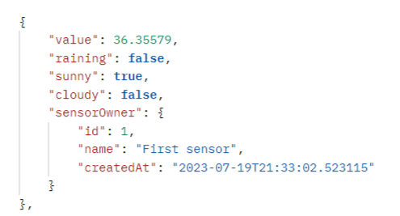
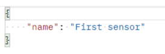
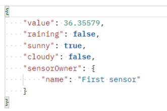

# Сервис по приему данных с метеостанций
Использованные технологии

* Spring Boot, Web, Data JPA
* Hibernate6
* База данных (PostgreSql)
* Thymeleaf5
* JUnit5

## Возможности приложения
* Регистрация нового сенсора в системе
* Добавление нового измерения, полученного от сенсора
* Получать все измерения
* Получать количество дождливых дней
* Получать количество солнечных дней

## Скриншоты
### Ответ на GET-запрос всех измерений

### POST запросы
Регистрация нового сенсора в системе      |  Добавление нового измерения
:------------------------:|:-------------------------:
    |  

# Также проложено приложение имитирующее работу сенсора

## Возможности приложения
* Передача метеостанции нового измерения